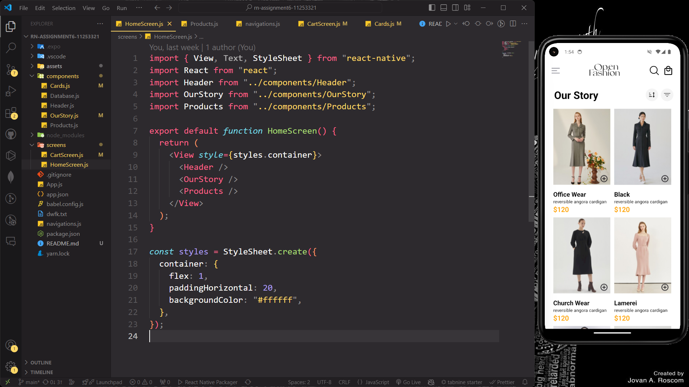
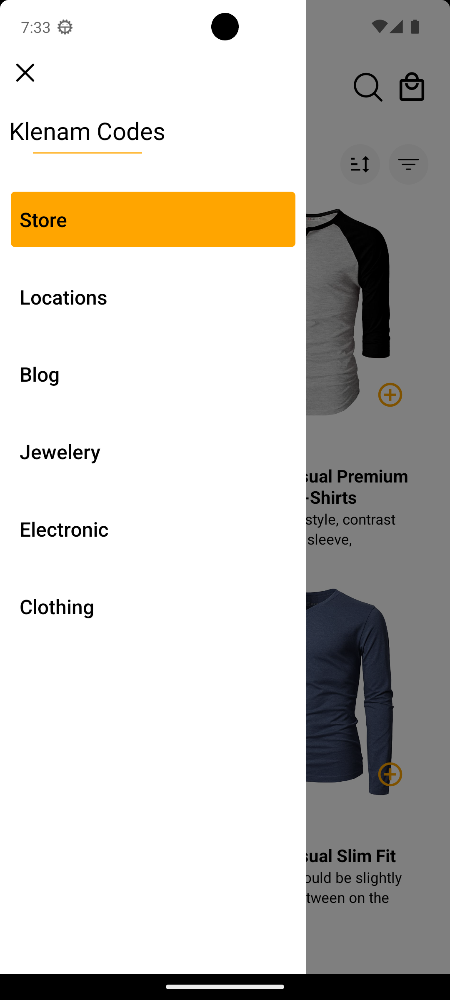
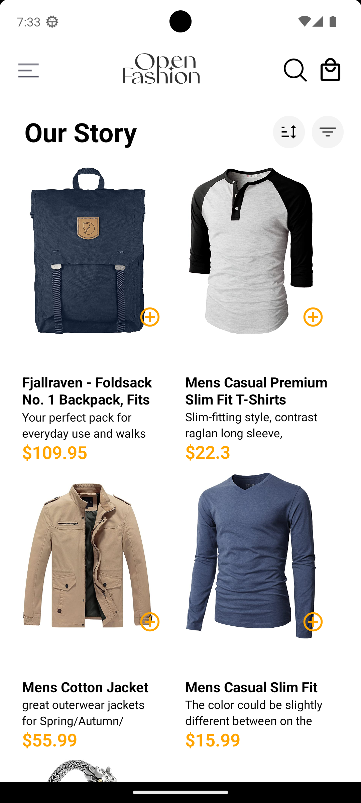
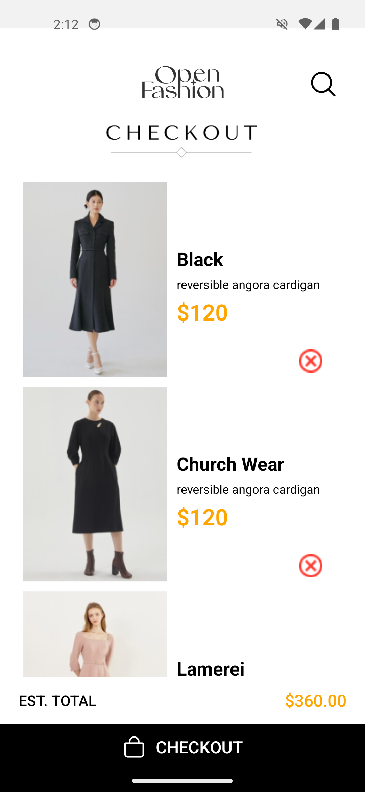
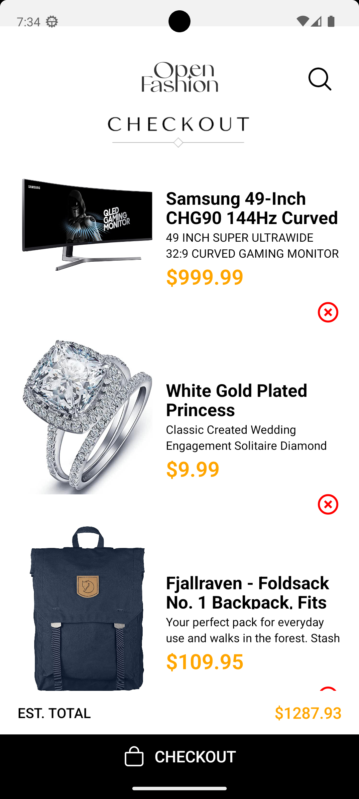
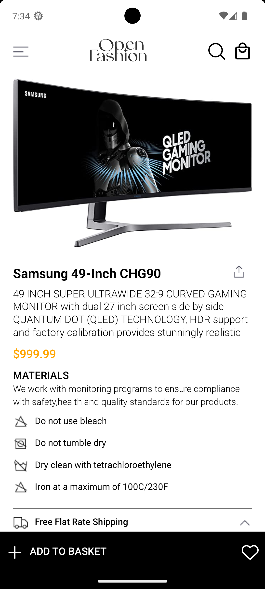

#

# SCREENSHOT OF APPLICATION

#

## How the Application was built

### I built the two screens, HomeScreen and CartScreen. HomeScreen get it's data from an api using "fetch". When an item is added to cart on the HomeScreen, it is stored locally and then its retrieved from the local storage and is displayed on the CartScreen. When an item is pressed, it leads to the ProductDetailScreen, where a detailed description of the specific product pressed is displayed.

 **1**
 **2**
 **3**
 **3**
 **3**
