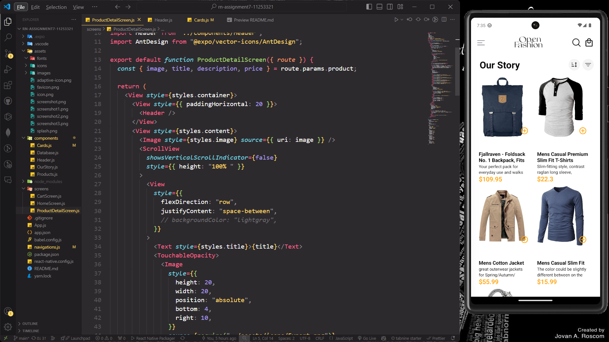

#

# SCREENSHOT OF APPLICATION

#

## How the Application was built

### I built the two screens, HomeScreen and CartScreen. HomeScreen get it's data from a local database in the project. When an item is added to cart on the HomeScreen, it is stored locally and then its retrieved from the local storage and is displayed on the CartScreen.

 **1**
 **2**
 **3**
